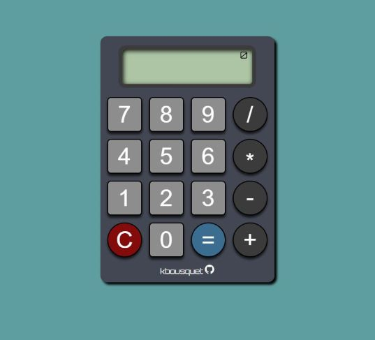

## Calculator

Implementation of a basic calculator from The Odin Project [curriculum](https://www.theodinproject.com/lessons/foundations-calculator).

Click [here](https://kbousquet.github.io/calculator) for the **Live version** of the game.

Trying to get the calculator logic for this project was particularly challenging but rewarding once I began to understand it.
* Gained more understanding of CSS grid
* Learned how to link up keyboard event listeners
* Refactored code to prevent redundancy and increase readability  
